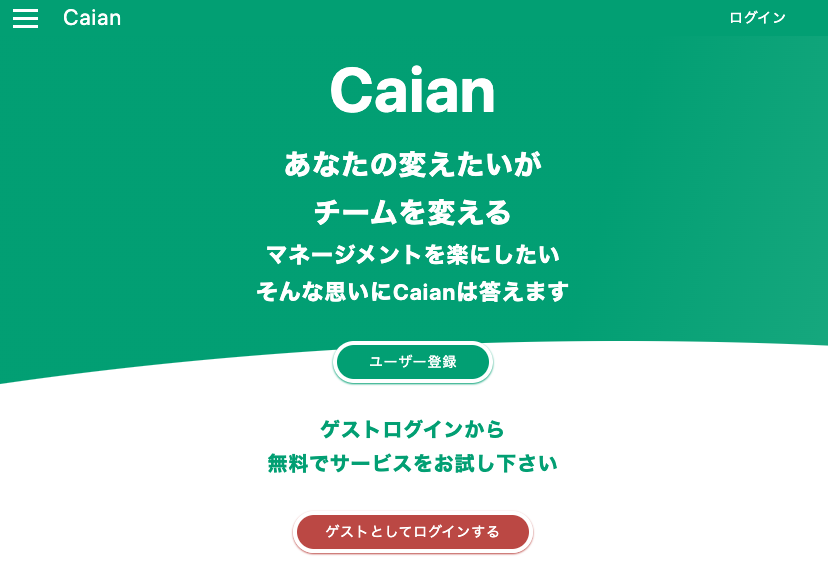
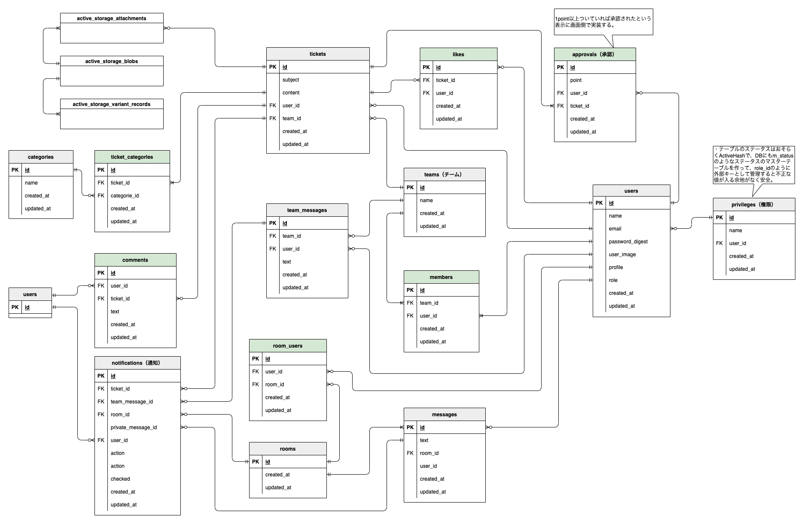
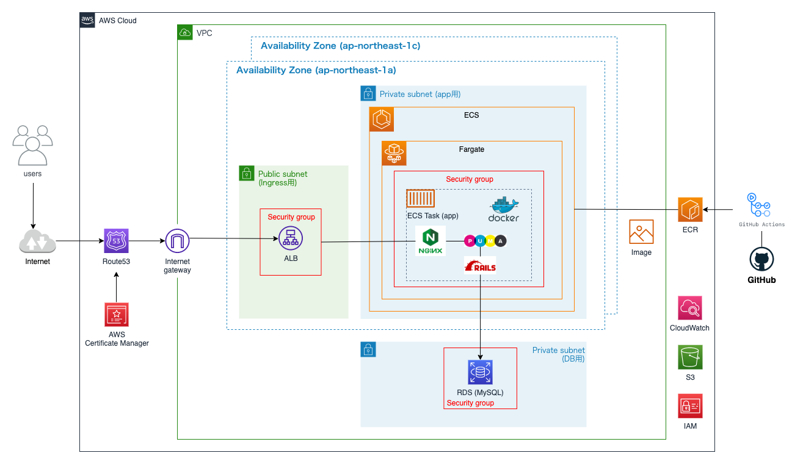
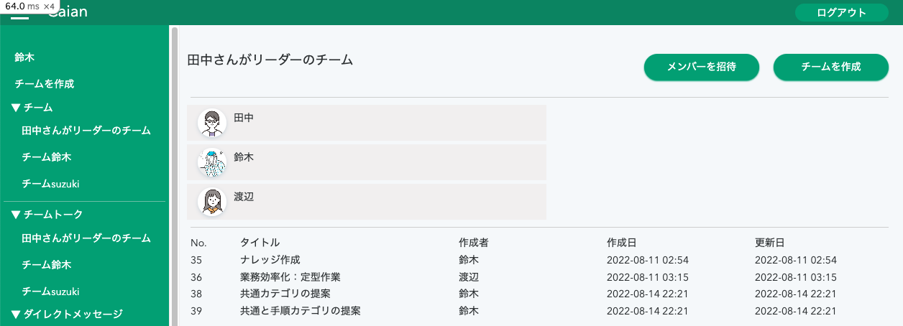
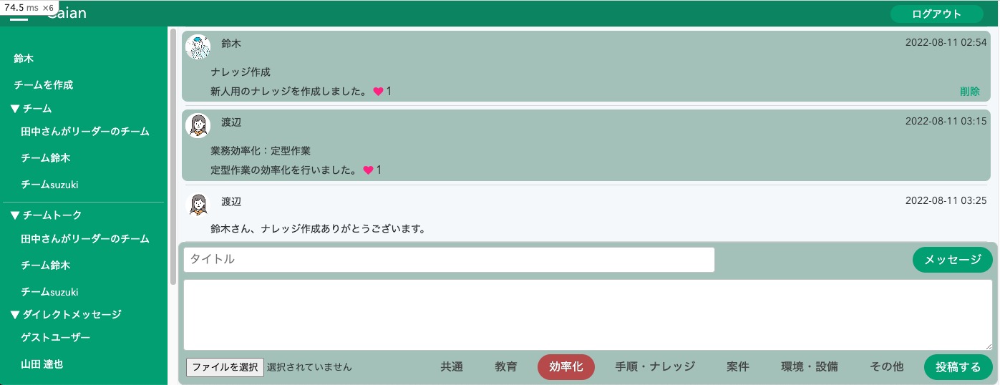

# Caian




## 開発環境

### ディレクトリ構成

Monorepo は、システムを構成する複数のコンポーネントの独立性を保ちつつ、全ての構成を1つのリポジトリで管理する手法です。

```bash
├ .github/
├ .vscode/
├ apps/
│ ├ backend/  # Rails
│ └ frontend/ # React
├ bin/
└ docs/
docker-compose.yml
README.md
```

### なぜ、Monorepoにしたか

下記のメリットから、Monorepo にすることで開発効率を向上させることができると考えました。

- システムに必要なコンポーネントが全て1つのリポジトリに集約される
- git clone を一度実行するだけで、システムの開発に必要なコードがすべて手に入る
- システム全体の把握が容易になり、コンポーネント同士の依存関係や共有コードの管理がしやすい
- システム全体がどういった変更がなされているのか、何が起きているかのトラッキングがしやすい
- それぞれのリポジトリにコミットすることの心理的ハードルを下げることができる

## 構築手順

1. リポジトリをクローンしたら、トップディレクトリに移動します。
2. 以下のコマンドを実行して、環境構築用のシェルを起動します。このシェルは、コンテナイメージの作成からサービスの立ち上げまでを行います。

```shell
./bin/setup_docker.sh
```

## [Wiki](https://github.com/aki366/Caian_app/wiki)

開発に関わるドキュメントについては、[wiki](https://github.com/aki366/Caian_app/wiki) を参照して下さい。

## 技術スタック

| Category | Technology |
| --- | --- |
| Front-end | React, javaScript, HTML/CSS |
| Back-end | Ruby, Ruby on Rails |
| Database | MySQL |
| Infrastructure, Web Server & Application Server | Nginx, Puma |
| Infrastructure, Cloud Service | AWS ( Route 53 / VPC / ALB / ECR / ECS (Fargate) / RDS / S3 ) |
| Testing | RSpec |
| Linting | RuboCop |
| CI/CD| GitHub Actions |
| Development Environment | Docker, Docker Compose, Docker Desktop |

## 設計

### ER図



### インフラ構成図



### 画面遷移図


## デザイン

[figma](https://www.figma.com/file/89WqHwRatfXBjokkGxmqq4/original?node-id=0%3A1)

### ユーザー詳細


### チーム管理



### チームトーク



## サービス概要

当サービスは、チームの実績評価を効果的に行うためのプラットフォームです。メンバーは自らの課題解決の実績を投稿し、リーダーがそれに対してポイントを付与します。各課題はカテゴリ別に分類されるため、チームや個人の強みや向き合うべき課題を明確に可視化することができます。

### リーダーとは何か？

チームを作成したユーザーは、自動的にそのチームのリーダーとしての役割を持ちます。このリーダーの特権として、メンバーが投稿したチケットの承認や評価などの特別なアクションを行うことができます。

**リーダーとしての悩み、持っていませんか？**

- 忙しさに追われ、メンバーの日々の活動や努力を正確に評価できていない
- 一貫した評価の基準が欠けており、メンバーに不満が生じている

これらの悩みにCaianが解決策を提供します。

**マネージメントはスマートであるべき、それが当然です。**

### メンバーとは何か？

メンバーとは、リーダーからの招待を受けてチームに参加したユーザーを指します。

**チームの一員として、これらの悩みを感じたことはありませんか？**

- 様々なタスクや改善活動に取り組んでいるものの、その承認プロセスが煩雑
- 実施したタスクや達成した成果を一元管理する方法がない
- 努力や成果をリーダーに効果的に伝える手段が不足している

自分の成果をもっと簡単に、そして明確に管理したいと思っているなら、Caianがその要望を叶えます。

**あなたの日々の努力は、当然のように評価されるべきです。**

### チケットの概要

チケットとは、業務の改善や手順の提案など、メンバーが意見や要求をまとめて共有するためのフォーマットです。

- メンバーは業務改善の提案や手順作成のアイディアをチケットとして作成・提出します。
- リーダーには、提出されたチケットに対して3段階の評価ポイントを付与し、それに基づいて承認を行う役割があります。
- さらに、評価や承認の際にコメントを付けることで、具体的なフィードバックや意見交換が可能となっています。

### 実績評価の仕組み

チケットを通じての実績評価は、以下の特徴を持っていま

- メンバーが提出するチケットは自動的に数値データに変換され、グラフとして視覚化されます。これにより、最新の実績を随時確認することができます。
- それぞれのメンバーの実績を統合することで、チーム全体の強みや改善点を一目で理解することが可能です。

## 制作背景

### 制作背景について

前職でリーダーを経験した際に、メンバーが行った改善活動や問題提起のアウトプット方法が様々で評価する際の数値化などに手間が掛っていました。そのため、せっかくの提案も実績として抜けていたり、透明性が無かったりという経験をしました
そういった背景から、もっと手軽に適切に、管理、評価できるサービスを提供できないかと考えこのサービスを開発しました。

## 機能一覧

### ユーザー機能

- ユーザー新規登録/編集/削除
- ユーザーアイコン登録/編集/削除
- ログイン/ログアウト/ゲストログイン
- パスワード再設定

### チケット機能

- 投稿/編集/削除
- 一覧表示、詳細表示
- 画像複数登録
- 投稿日時表示
- 投稿者
- ステータス
- カテゴリ
- 件名
- 内容
- いいね
- チケットとコメントを同一画面で表示
- チケット内容の表示（トップ画面に簡易表示、一覧表示、詳細表示、ソート機能）

### チケットへのコメント機能

- 投稿/編集/削除
- 投稿日時表示
- コメント

### チャット機能

- チャンネル
- ダイレクトメッセージ
- メッセージ投稿
- チケットの投稿

### 実績の数値化・グラフ化

- 投稿数
- 加点
- ポイント（投稿数＋加点）
- ユーザ一覧で実績表示（リーダーのみ表示）

### 今後リリース予定の機能

- レスポンシブデザイン
- 検索機能
- リマインダー機能
- 通知機能（投稿、更新）
