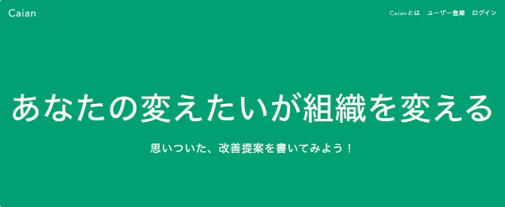
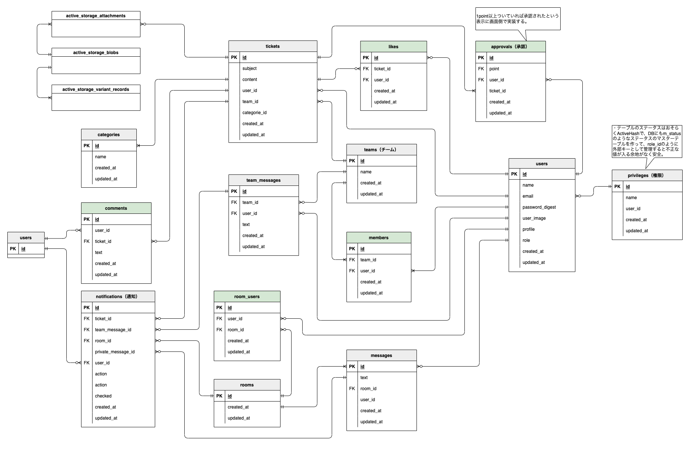
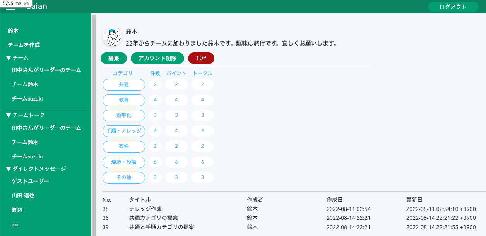
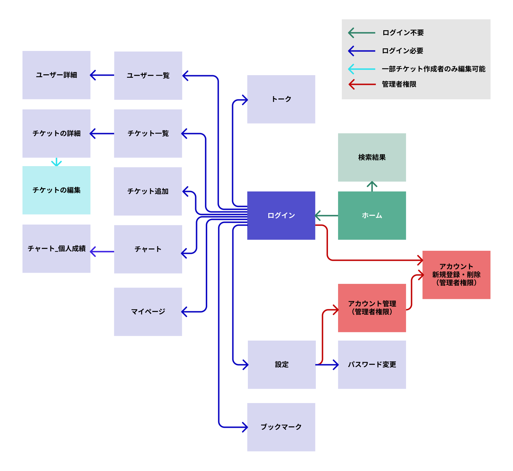

# Caian

 
※現在開発中の為、サービスを公開しておりません。

## 開発実績
- 2022/02/01 開発開始
- 2022/08/13 時点(total：964.0h)

 
  
  

## 設計

### ER図

ER図（表示）

### インフラ構成図

### 画面設計図

[figma:画面設計図](https://www.figma.com/file/89WqHwRatfXBjokkGxmqq4/original?node-id=0%3A1)

ユーザー詳細（表示）

チーム管理（表示）

チームトーク（表示）

### 画面遷移図

画面遷移図（表示）

 

## Caianとは
### チームリーダーのマネージメントをサポートする
### 実績評価とチケット管理が一つになったSNSサービスです

 

## サービス概要
このサービスはチームに所属するメンバーとメンバーが投稿した提案を評価するリーダーで構成されています。

### リーダーとメンバー

リーダーとは（表示）

 
チームを新規作成したユーザーは自動でそのチームのリーダーになります。 
リーダーは、メンバーが投稿したチケットの承認や評価などの機能が使用できます。 
 

**あなたはチームのリーダーとしてこんな悩みを抱えていませんか？** 

- メンバーの日々の頑張りを評価に反映したいが、忙しくて把握できない 
- 定量的な評価がされず不満を抱いているメンバーがいる 

もっとメンバーの日頃の成果を評価したい、マネージメントに集中したい! 
そんな思いにCaianは答えます 

**マネージメントをもっとスマートに、当たり前に** 
 

メンバーとは（表示）

 
リーダーから招待されてチームに所属したユーザーのこと 
 

**あなたはチームの一員としてこんな悩みを抱えていませんか？** 

- 日々、タスクや改善活動をしているが、承認フローが面倒 
- 自分が行ったタスクや成果を一元管理できていない 
- 日々の成果をリーダーにアピールできていない 

もっとスマートに自分の成果を管理したい! 
そんな思いにCaianは答えます。 

**あなたの努力は努力せずに評価されます。** 
 

### 主要サービス

チケット管理（表示）

 

- 日々のちょっとした業務改善や手順作成の連絡と承認を1つのチケットで管理できます。
- リーダーはメンバーが作成したチケットに３段階の評価ポイントを付けて承認するだけです。
- コメントを添えてフィードバックすることも可能です。
 

実績評価（表示）

 

- メンバーが投稿したチケットは自動で数値化、グラフ化され、いつでも最新の実績を把握することができます。
- メンバーごとの実績をマージしてチームの強みと弱みを視覚的に把握できます。
 

SNS機能（表示）

 

- メンバー同士でメッセージを交換することも可能です。
- 提案された投稿やコメントにメンバー同士で『いいね！』を付けることができます。
 

 

## サービス開始の流れ

ユーザー登録 簡単1ステップ（表示）

 

- あなたは所属するチームのリーダーから招待を受け取りメンバーになるだけ。
- あなたがリーダーとなって、自由にチームを作りメンバーを招待することも可能です。
- 役職や細かい権限の設定は不要。リーダーかメンバーだけです。

 

## 制作背景

制作背景について（表示）

 
前職でリーダーを経験した際に、メンバーが行った改善活動や問題提起のアウトプット方法が様々で評価する際の数値化などに手間が掛っていました。そのため、せっかくの提案も実績として抜けていたり、透明性が無かったりという経験をしました。 
そういった背景から、もっと手軽に適切に、管理、評価できるサービスを提供できないかと考えこのサービスを開発しました。

 

## 使用技術
※1　実装予定
### フロントエンド
- HTML/CSS
- JavaScript
- chart.js　※1
- Vue.js　※1
- Vuetify　※1
- Nuxt.js　※1

### バックエンド
- Ruby 3.0.3
- Ruby on Rails 6.1.4.3
- MySQL 8.0.30

### インフラ
- Heroku
- Nginx/Puma
- AWS(VPC/EC2/RDS/ALB/S3/ACM/Route53)　※1
- ECS（Fargate）　※1

### テスト
- RSpec
- Jest

### 解析ツール
- RuboCop

### CI/CD
- CircleCI
- Capistrano

### バージョン管理
- Git/GitHub

### 開発環境
- VScode
- Docker/docker-compose

## 機能一覧

ユーザー（表示）

 

- ユーザー新規登録/編集/削除
- ユーザーアイコン登録/編集/削除
- ログイン/ログアウト/ゲストログイン
- パスワード再設定
 

チケット（表示）

 

- 投稿/編集/削除
- 一覧表示、詳細表示
- 画像複数登録
- 投稿日時表示
- 投稿者
- ステータス
- カテゴリ
- 件名
- 内容
- いいね
- チケットとコメントを同一画面で表示
- チケット内容の表示（トップ画面に簡易表示、一覧表示、詳細表示、ソート機能）
 

チケットへのコメント（表示）

 

- 投稿/編集/削除
- 投稿日時表示
- コメント
 

チャット機能（表示）

 

- チャンネル
- ダイレクトメッセージ
- メッセージ投稿
- チケットの投稿
 

実績の数値化・グラフ化（表示）

 

- 投稿数
- 加点
- ポイント（投稿数＋加点）
- ユーザ一覧で実績表示（リーダーのみ表示）
 

その他（表示）

 

- 検索機能
- レスポンシブデザイン
＜以下余裕があれば実装＞
- リマインダー機能
- 通知機能（投稿、更新）
 

