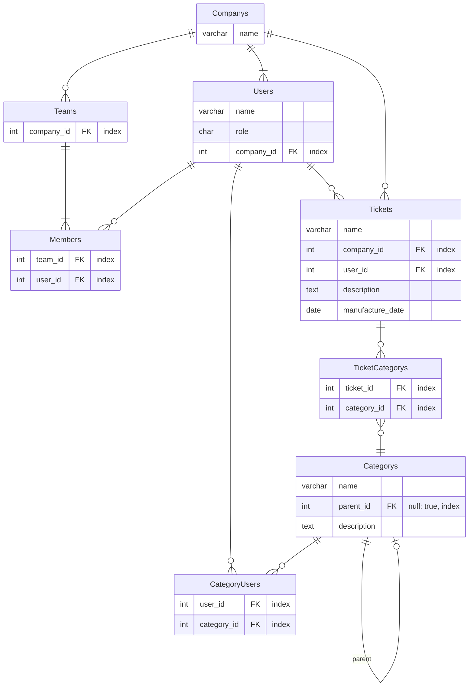

# カテゴリ機能：categorys
## 要望
- 企業に属するメンバーの実績データをお元にチャートにして可視化したい
- チームに属するメンバーの実績データは同じ企業に属していれば参照可能にしたい
- チームに属しているメンバーは同じ評価軸とは限らないので、チームごとではなくメンバーごとに設定できるカテゴリの上限を設定したい
- カテゴリの設定は権限を持った人が設定できること

## 機能
- 上限数
  - 1企業が設定できるカテゴリは上限を設定しない
  - 1チームのが設定できるカテゴリは上限を設定しない
  - 1ユーザーは最大で30個カテゴリーを設定できること
- 権限
  - adminユーザーのみ、カテゴリーの管理画面にアクセスできること
- 管理画面
  - 管理画面からのみ、作成・編集・削除が行えること
  - 管理画面からのみ、親子関係の設定が行えること
  - カテゴリはデフォルトで設定されたカテゴリの他に任意で設定できること
  - 親カテゴリに対して、子カテゴリ、孫カテゴリ、ひ孫カテゴリも作成できること

## 非機能

## 対象画面
- `/categorys/`
- `/tickets/show/`
- `/tickets/index/`
- `/users/show/`

## 設計
### ERD

